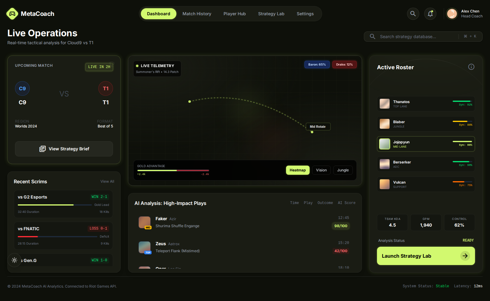

# MetaCoach - Professional Esports Analytics Platform

<div align="center">
  
  <h3 style="color: #D2F96F;">Next-Generation Tactical Intelligence</h3>
</div>

<div align="center">
  
</div>

---

**MetaCoach** is a high-performance, AI-driven analytics dashboard designed for professional esports coaching staff. Built with a focus on real-time data visualization, it provides deep insights into live match operations, player performance, and strategic execution.

The platform features a distinctive **Cyber/Dark aesthetic** optimized for low-light gaming environments, utilizing a high-contrast Neon Lime (`#D2F96F`) accent system for critical information hierarchy.

## 🚀 Key Features

*   **Live Operations Dashboard**: Real-time visualization of match telemetry, including gold leads, objective control (Baron/Drake), and map rotations.
*   **AI Strategy Engine**: "Gemini Engine v2.0" integration for analyzing opponent tendencies and suggesting counter-strategies.
*   **Roster Management**: Comprehensive player tracking with synergy scoring and performance metrics (KDA, GPM, Control Scores).
*   **Immersive Onboarding**: A streamlined setup flow (Choose Game -> Sync Roster -> Calibrate AI) to get coaches up and running in seconds.
*   **Client-Side Persistence**: Fully offline-capable architecture using `Dexie.js` for secure, local data storage of teams and strategies.
*   **Adaptive UI**: Responsive design featuring a fixed navigation rail and nested routing for seamless multitasking.

## 🛠️ Technical Architecture

MetaCoach is built on a modern, type-safe stack designed for performance and maintainability.

### Core Stack
*   **Framework**: [React 19](https://react.dev/)
*   **Build Tool**: [Vite](https://vitejs.dev/)
*   **Language**: [TypeScript](https://www.typescriptlang.org/)
*   **Styling**: [Tailwind CSS v4](https://tailwindcss.com/) (CSS-first configuration via `@theme`)
*   **Routing**: [React Router v7](https://reactrouter.com/)
*   **State/Storage**: [Dexie.js](https://dexie.org/) (IndexedDB wrapper)
*   **Icons**: Material Icons & Lucide React

### Design System
The application implements a custom design system defined directly in CSS variables:
*   **Primary Color**: `#D2F96F` (Neon Lime)
*   **Backgrounds**: `#0E100A` (Deep Black) / `#1A1C14` (Surface Dark)
*   **Typography**: `Inter` (UI) and `Courier New` (Data/Code)
*   **Effects**: Custom glow shadows (`box-shadow: neon`) and backdrop blurs.

## 📦 Getting Started

### Prerequisites
*   Node.js (v18 or higher)
*   npm or yarn

### Installation

1.  **Clone the repository**
    ```bash
    git clone https://github.com/your-org/metacoach.git
    cd metacoach
    ```

2.  **Install dependencies**
    ```bash
    npm install
    ```

3.  **Start the development server**
    ```bash
    npm run dev
    ```
    The app will run at `http://localhost:3000`.

4.  **Build for production**
    ```bash
    npm run build
    ```

## 📂 Project Structure

```
metacoach/
├── components/          # React components
│   ├── dashboard/       # Dashboard-specific widgets & layout
│   ├── onboarding/      # Onboarding flow components
│   └── ...              # Shared UI components (Auth, Landing, etc.)
├── hooks/               # Custom React hooks
├── lib/                 # Utilities & Database configuration (db.ts)
├── verification/        # Playwright verification scripts
├── App.tsx              # Main application entry & routing
├── index.css            # Global styles & Tailwind @theme config
├── index.html           # HTML entry point & font loading
└── vercel.json          # Deployment configuration (SPA rewrites)
```

## 🚢 Deployment

The project is configured for seamless deployment on [Vercel](https://vercel.com).

A `vercel.json` file is included to handle Single Page Application (SPA) routing, ensuring that all paths redirect to `index.html` to let React Router handle the navigation.

```json
{
  "rewrites": [
    {
      "source": "/(.*)",
      "destination": "/index.html"
    }
  ]
}
```

## 🎥 Marketing Assets
 
A programmatic launch video is avaiable in `docs/videos/launch.mp4`.
 
The source code is in the `video/` directory.
 
## 🤝 Contributing

1.  Fork the repository.
2.  Create a feature branch (`git checkout -b feature/amazing-feature`).
3.  Commit your changes (`git commit -m 'Add some amazing feature'`).
4.  Push to the branch (`git push origin feature/amazing-feature`).
5.  Open a Pull Request.

## 📄 License

This project is licensed under the MIT License - see the LICENSE file for details.

---

<div align="center">
  <p>© 2024 MetaCoach AI Analytics. Connected to Riot Games API.</p>
</div>
